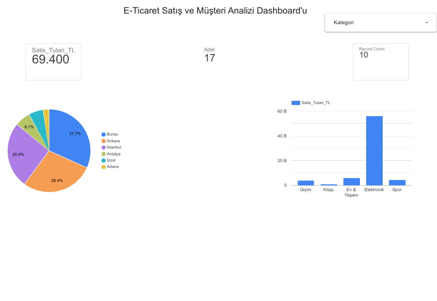

# 📊 E-Ticaret Satış & Müşteri Analizi Dashboard'u (Looker Studio)

Bu proje, bulut tabanlı veri kaynakları (Google Sheets) kullanılarak e-ticaret satış performansını, kategori bazlı ciro dağılımlarını ve şehir bazlı müşteri yoğunluklarını etkileşimli görsel paneller üzerinden izlemek amacıyla kurgulanmıştır.

## 📌 Kullanılan Teknolojiler & Araçlar
* **Google Looker Studio (Data Studio):** Etkileşimli Görselleştirme ve İş Zekası Paneli
* **Google Sheets:** Bulut Tabanlı Veri Kaynağı Yapılandırması
* **Metrikler & KPIs:** Toplam Ciro, Sipariş Adedi, Kategori Bazlı Satış Hacmi, Şehir Bazlı Müşteri Yoğunluğu

## 🛠️ Dashboard Bileşenleri
1. **Ana KPI Kartları:** Toplam Satış Tutarı (TL), Toplam Sipariş Adedi ve Satılan Ürün Adedi.
2. **Kategori Bazlı Ciro Analizi:** Hangi ürün kategorisinin daha fazla gelir getirdiğini gösteren dikey çubuk grafik.
3. **Şehir Bazlı Müşteri Dağılımı:** Bölgesel satış hacmini gösteren pasta grafik.
4. **Dinamik Filtreleme:** Kategori ve Şehir bazlı dinamik veri süzgeçleri.

## 📸 Dashboard Görünümü

